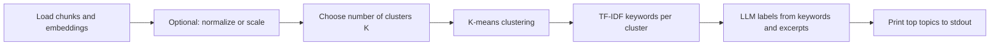
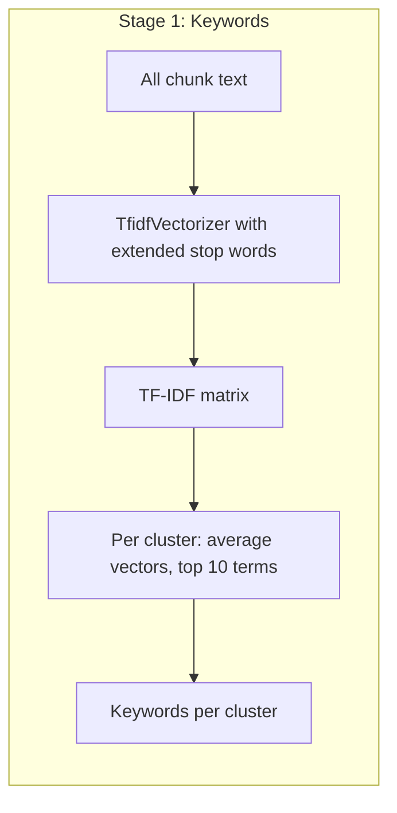
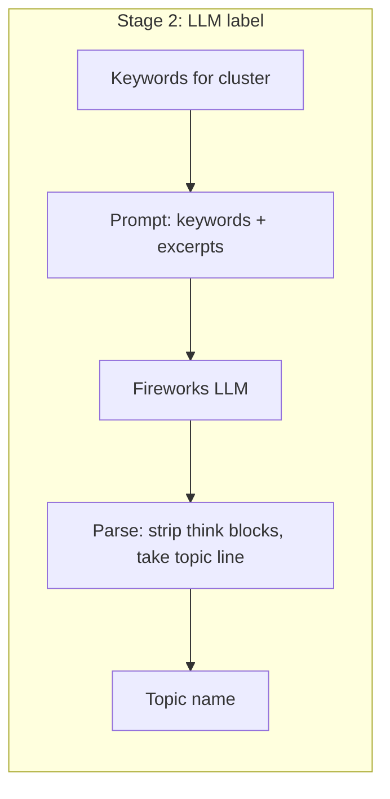
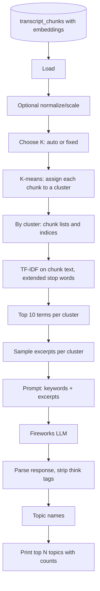

# Topic Extraction Script — How It Works

This document explains how **`topic_extraction_service.py`** works: from transcript chunks and their embeddings to a list of topic names with chunk counts. The script is read-only (no database writes) and is not a Prefect job. It uses K-means clustering and a two-stage labeling process (TF-IDF keywords + LLM).

---

## Prerequisites: Embeddings and Semantic Search

Your transcripts are split into **chunks** (overlapping segments of text). Each chunk has an **embedding**: a list of 768 numbers produced by a model (Qwen3-Embedding-8B). You already use these embeddings for **semantic search**: when you search for "John Kicks Ass," the system finds chunks whose embedding is *close* to the embedding of the query. "Close" here means *semantically similar* — the model turns meaning into position in a 768-dimensional space so that similar topics sit near each other.

Topic extraction uses the same idea: chunks that talk about the same kind of thing have similar embeddings, so they sit near each other in that space. The script **groups those nearby chunks** (clustering) and then **assigns each group a short topic name** (labeling).

---

## High-Level Pipeline

The script does the following in order:



1. **Load** — Read transcript chunks (and their 768-d embeddings) from the database, optionally filtered by podcast or episode range.
2. **Prepare** — Optionally L2-normalize and/or standard-scale the embeddings (e.g. `--semantic` for cosine-like similarity).
3. **Choose K** — Pick how many clusters (topics) to create: either automatically with a silhouette score or a fixed value you pass in.
4. **Cluster** — Run K-means so each chunk is assigned to one of K groups.
5. **Keywords** — For each group, compute which words are most distinctive (TF-IDF over the chunk text), and keep the top terms (excluding filler like "yeah," "just").
6. **Label** — For each group, send those keywords plus a few sample excerpts to an LLM and ask for a short topic name (2–6 words).
7. **Output** — Print the top N topics with chunk count, percentage, and episode count.

The rest of this doc explains **step 4 (K-means)** and **steps 5–6 (two-stage labeling)** in plain English.

---

## How K-Means Clustering Works (Plain English)

You have thousands of chunks, each with an embedding (768 numbers). In principle, chunks about "movies" are close together in this space, and chunks about "food" are close together elsewhere. **K-means** is a way to partition the chunks into K groups so that chunks in the same group are close to each other.

You don't need the math; the idea is:

1. **Pick K** — You decide how many groups you want (e.g. 20). That's K.
2. **Start with K "centers"** — The algorithm places K points in the same 768-d space as your chunks. At the start these are random (or chosen from your data).
3. **Assign each chunk to the nearest center** — For every chunk, measure distance to each of the K centers. Put the chunk in the group whose center is closest. So you get K buckets of chunks.
4. **Move each center to the middle of its bucket** — For each bucket, average the embeddings of all chunks in it. That average is the new "center" for that group.
5. **Repeat 3 and 4** — Re-assign chunks to the (updated) nearest center, then recompute centers. Keep doing this until assignments barely change.

When it's done, every chunk belongs to exactly one cluster. Clusters are "blobs" of chunks that sit near each other in embedding space — i.e. they're semantically similar.

**Simple picture (conceptually; real data is 768-dimensional):**

```
2D sketch of embedding space (each dot = one chunk):

  • • •                    • • •
  • • • •     K=3          • • • •     →  Cluster A (e.g. movies)
  • • •                    • • •
        • •                      • •
        • • •    ————>           • • •   →  Cluster B (e.g. food)
        • •                      • •
              • • •                  • • •
              • • • •                • • • •  →  Cluster C (e.g. banter)
              • • •                  • • •
```

**How the script chooses K** — If you don't pass `--n-clusters`, the script tries several values of K (between `--min-clusters` and `--max-clusters`) and uses the **silhouette score**: a number that is high when chunks are close to their own cluster's center and far from other clusters. The K with the best score is used. So "how many topics" is either fixed by you or picked automatically in a reasonable range.

---

## How the Two-Stage Labeling Process Works

After K-means you have K clusters of chunks, but no names — just "cluster 0," "cluster 1," etc. **Labeling** means giving each cluster a short, human-readable topic name (e.g. "Movie and TV talk," "Drinking and bar stories").

Sending only a few chunk excerpts to an LLM is risky: the model might latch onto a phrase that appears in one excerpt but isn't representative of the whole cluster (e.g. "Kendrick Lamar" in one chunk → wrong label for a big cluster). So the script uses a **two-stage** approach: first compute **statistical keywords** for the cluster, then ask the LLM to name the topic **from those keywords** (plus a few excerpts for context). That keeps labels grounded in what the cluster is actually about.

### Stage 1: TF-IDF Keywords per Cluster

**Goal:** For each cluster, get a short list of words that are **distinctive** for that cluster (common there, relatively less common elsewhere). Those words are the "fingerprint" of the topic.

**What the script does:**

1. Take all chunk **text** (not the embeddings) and build a **TF-IDF** representation. TF-IDF is a standard way to turn text into numbers: it emphasizes words that appear often in a document (or here, in a cluster) but not everywhere in the corpus. So "movie" might score high in one cluster and "cops" in another, while "yeah" and "just" are downweighted or removed.
2. The script uses an **extended stop list**: besides normal English stop words, it removes podcast filler like "yeah," "just," "don," "know," "oh," "fucking," "think," etc. So the remaining terms are more **semantically rich** (e.g. "movie," "cops," "food," "racist").
3. For each cluster, it averages the TF-IDF vectors of all chunks in that cluster and picks the **top 10 terms** (by that average score), ignoring words shorter than 3 characters. So each cluster gets something like: `movie, movies, film, watch, good, guy, car, cops, bar, drink`.

No heavy math needed: **TF-IDF + averaging per cluster + top terms = "which words best describe this cluster."**

**Flow:**



### Stage 2: LLM Label from Keywords + Excerpts

**Goal:** Turn the list of keywords (and a few sample excerpts) into one short topic name (2–6 words) that a human would recognize.

**What the script does:**

1. For each cluster to be labeled (the top N by chunk count or by episode count), it collects:
   - The **keywords** from Stage 1 (e.g. `movie, movies, film, watch, good, guy, car, cops, bar, drink`).
   - A few **representative excerpts** from that cluster (episode-diverse, so not all from one episode).
2. It sends to the Fireworks LLM a **prompt** that:
   - Shows the **keywords first** (the statistical grounding).
   - Then shows the **excerpts** (for context).
   - Asks for **one short topic name** that reflects the **keywords**, and says not to name the topic after a detail that only appears in one excerpt.
3. The script asks the API for no "reasoning" output (`reasoning_effort: "none"` when supported); if the API errors, it retries without that parameter. It then **parses** the response: strips any `<think>...</think>` blocks and skips lines that are just tags, so the final label is never literally "<think>".
4. That string is the **topic name** for the cluster (e.g. "Movies and TV discussion," "Cops and bar stories").

So: **keywords constrain** what the model can name; **excerpts add context**. Together you get stable, on-topic labels.

**Flow:**



---

## End-to-End Diagram

Putting clustering and two-stage labeling together:



---

## What You Get When You Run the Script

- **Input:** Chunks (and embeddings) from the DB, optionally filtered by `--podcast-id`, `--first-n-episodes`, or `--last-n-episodes`.
- **Output:** Lines printed to stdout, e.g.  
  `1. Movie and TV discussion — 412 chunks (9.2%) | 45 eps`  
  with optional `--show-keywords` to print the TF-IDF keywords under each topic.

No new tables or files are written. You can re-run with different options (e.g. `--n-clusters`, `--semantic`, `--rank-by chunks` or `episodes`) to explore.

---

## How to Run

From the **repository root**:

```bash
FIREWORKS_API_KEY=... DB_HOST=... DB_PASSWORD=... \
  python topic_extraction_service.py --podcast-id 1 --last-n-episodes 150 --min-chunks-per-episode 2
```

For a full list of options and what each flag does, see **`docs/TOPIC_EXTRACTION_SCRIPT.md`**.

---

## Summary

| Step | What happens (plain English) |
|------|-------------------------------|
| Load | Read chunks and their 768-d embeddings from the DB (with optional filters). |
| Prepare | Optionally normalize/scale so distances match semantic similarity (e.g. cosine-like). |
| Choose K | Decide number of topics: auto (silhouette over a range) or fixed. |
| K-means | Partition chunks into K groups so that chunks in the same group are close in embedding space. |
| TF-IDF keywords | For each group, find the words that best distinguish it (extended stop list, top 10 terms). |
| LLM label | For each group, send keywords + a few excerpts to the LLM; parse out one short topic name. |
| Print | Show the top N topic names with chunk count, percentage, and episode count. |

The script is **only** about this pipeline: no Prefect, no topic tables, no API. It uses K-means for aggregation and a two-stage (TF-IDF + LLM) process so topic names are grounded in the actual words that define each cluster.
